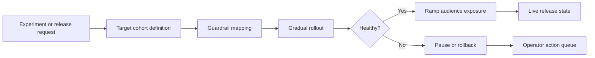
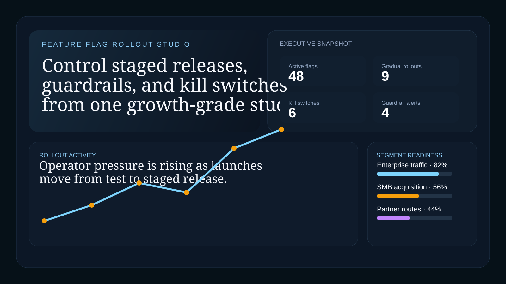
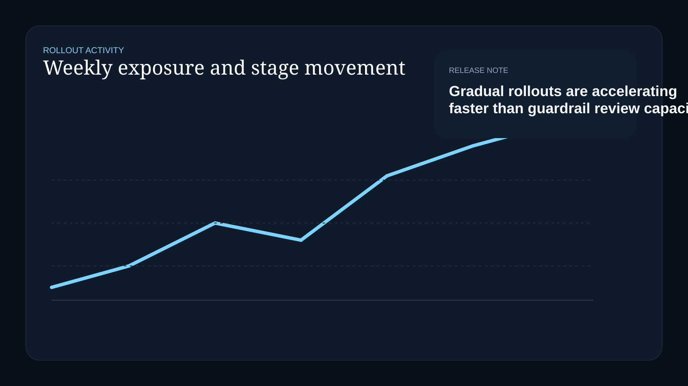
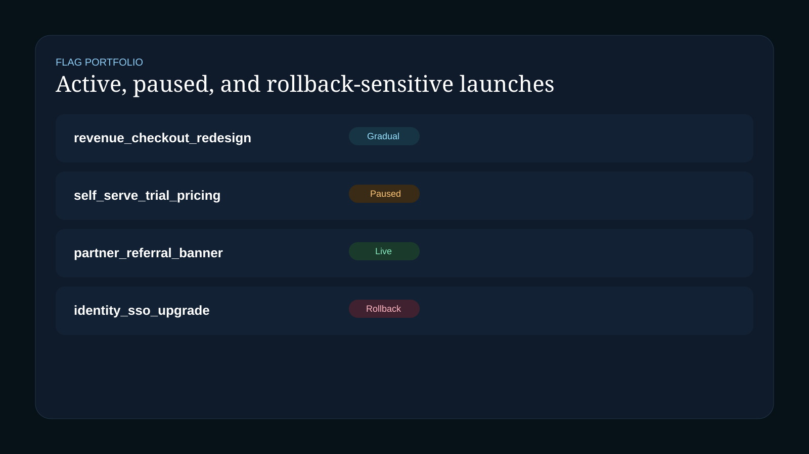
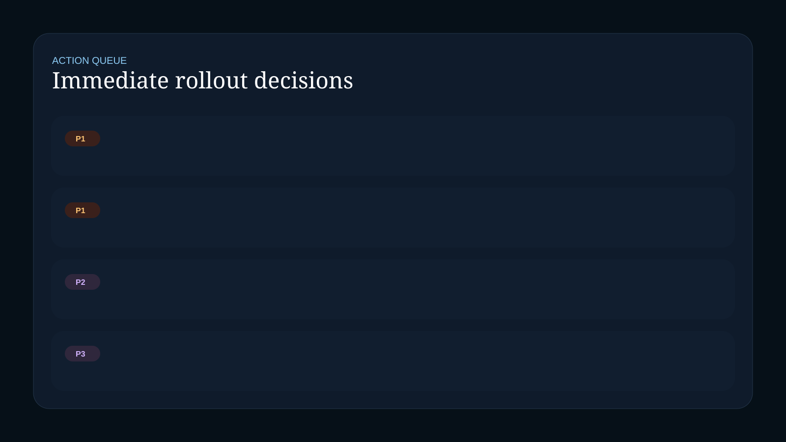

# Feature Flag Rollout Studio

React + TypeScript rollout workspace for staged releases, segment targeting, experiment-linked delivery, and kill-switch-ready operational control.

## Recruiter Takeaway

This project shows operator-facing frontend systems design for feature releases that need more than a simple toggle. It translates experimentation and rollout pressure into segment readiness, guardrails, launch states, and explicit next actions.

## Tech Stack

[](https://react.dev/)
[](https://vite.dev/)
[](https://www.typescriptlang.org/)
[](https://developer.mozilla.org/en-US/docs/Web/CSS)
[](https://vitest.dev/)
[](https://opensource.org/license/mit)

## Overview

| Area | What it covers |
| --- | --- |
| Executive snapshot | Active flags, gradual launches, kill switches, guardrail alerts |
| Rollout activity | Weekly release pressure across staged launches |
| Segment readiness | Audience targeting by channel and commercial posture |
| Flag portfolio | Live, paused, gradual, and rollback-sensitive releases |
| Guardrails | KPI and performance checks attached to launch decisions |
| Action queue | Immediate operator decisions and escalation items |

## Business Problem

Feature-flag tooling often stops at “on or off.” Real rollouts need more:

- audience-aware exposure
- experiment linkage
- risk-based pause and rollback decisions
- guardrails around revenue, latency, or conversion
- operator visibility when rollout pressure rises

Feature Flag Rollout Studio reframes rollout management as an operational workspace rather than a developer-only toggle panel.

## Architecture



## What This Demonstrates

- Internal-tool UX for growth and release operations
- A visual language for rollout states, warnings, and guardrails
- Multi-panel product thinking rather than a single dashboard view
- Frontend system design aligned to experimentation and launch workflows

## Screenshots

### Hero Capture



### Rollout Activity



### Flag Portfolio



### Action Queue



## Local Run

```powershell
Set-Location "C:\Users\chaus\dev\repos\feature-flag-rollout-studio"
npm install
npm test
npm run build
npm run dev
```

## Portfolio Links

- [Kinetic Gain](https://kineticgain.com/)
- [Skills / Portfolio](https://mizcausevic.com/skills/)
- [LinkedIn](https://www.linkedin.com/in/mirzacausevic)
- [Medium](https://medium.com/@mizcausevic)
- [GitHub](https://github.com/mizcausevic-dev)
