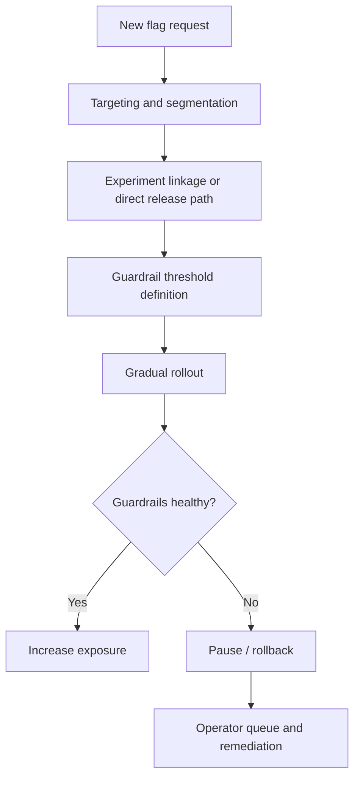

# Architecture Notes

## Product Intent

Feature Flag Rollout Studio is designed as an operator-facing command surface for staged launches, not a plain developer toggle table.

The goal is to make rollout decisions legible for:

- growth engineering
- RevOps
- product operators
- platform and security teams
- leadership watching commercial guardrails

## Workflow Model

## Interface Blocks

- **Hero panel**: sets the business context for the rollout workspace.
- **Executive snapshot**: compresses the launch surface into fast metrics.
- **Trend panel**: highlights weekly release pressure and rollout volume.
- **Segment readiness**: shows where launches can safely expand next.
- **Flag portfolio**: keeps active launch states visible.
- **Guardrails**: ties product changes to business and performance safety checks.
- **Action queue**: turns risk into explicit next decisions.
